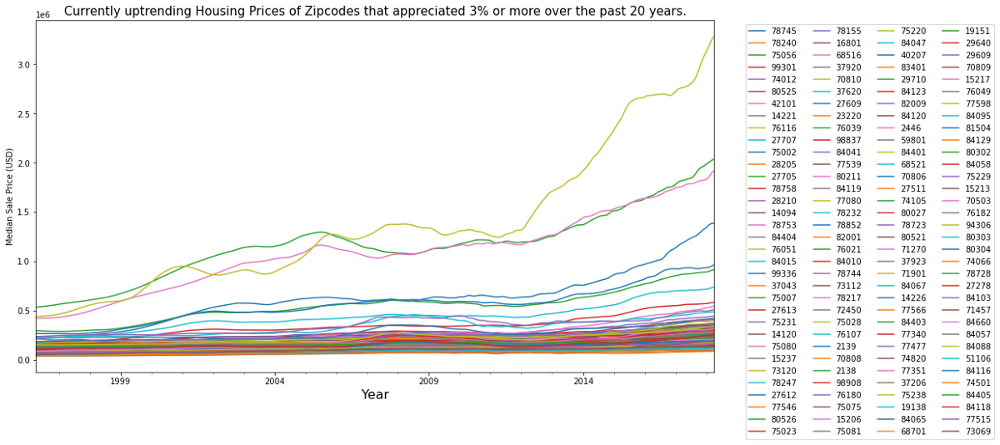
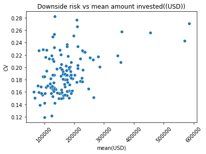
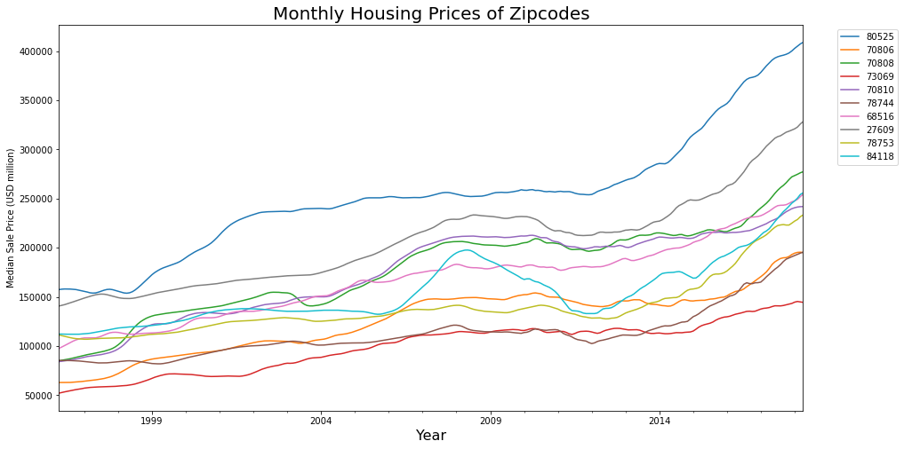

# Project - Time Series Analysis of Zillows housing Data. 
# Introduction:
For most Americans, their biggest financial investment is their house. To that end there is a lot of money in real estate for investors, REITs or simply an individual home owner who is interested in buying a house as a retirement investment. With this in mind **the goal** of this project is to determine 5 zipcodes in the US for investing and then forecast their return rates using the Box-Jenkins methods. 

#  Data:
 Zillow's research data used for this analysis can be found [here](https://www.zillow.com/research/data/). The data contained about 15k zipcodes. The data did not require any major cleaning or pre-processin; the only changes that were  made was to convert the data into date time object using pandas and then reshaping it from wide to long format using pandas melt funtion.

In an effort to determine the best real estate markets, zipcodes were filtered  as follows :
* Zip codes with the highest urbanization (top 25%) based on Zillow’s urbanization metric.
* Zip codes that did not depreciate during the great recession (07–08)
* Zip codes that have returned 3 % or more over the past 20 years
* Zip codes that are experiencing an uptrend in appreciation rates for past 2 years.

This resulted in about 100 zip codes as seen below:

 Furthermore to determine whether the expected return of the investment is worth the degree of volatility the downside risk was assessed using the coefficient of variance. Downside risk was a constant and had a strong positive correlation with return rates but a relateively weak positive correlation with the amount invested as seen below.

The 100 zipcodes were filtered based on low downside risk regardless of the amount invested. After trying a bunch of subsets the 4th quintile was chosen as it gave the best returns. This resulted in about 25 zipcodes. Out of these 25 zipcodes the top 10 (shown below) with highest returns were chosen for forecasting.

# Detrending and assessing/choosing ARMA parameters for modelling

Log transformation, rolling means, and differencing was used to detrend the time series and stationarity was evaluated using the Dickey-Fuller Test. Log transform and rolling mean were not very effective as it yielded only 1/10 to be stationary.First order finite differencing resulted into 5 of the time series to be stationary. Second order resulted differencing resulted in all time series to be almost stationary with a mild seasonal component. This seasonality was assessed using ACF and PACF plots, and a lot of the time seies had more than 1 significant MA and QA orders. So the best option was to chose the optimum parameters using some form of gridsearch or parameter turning. Since this had to be done for 10 zipcodes the most efficent way was to use a  Python wrapper that automatically selects the parameters. More info on this can be found [here.](https://alkaline-ml.com/pmdarima/)

#  ARIMA Modeling
Using Auto arima parameters I chose to utilize the SARIMAX model considering the seasonality in the time series. The projections were perfomed using dynamic forecasting to predict a 5 yr projection of all 10 zipcodes. Based on this projection 5-year returns were calculated. A sample of the statsmodel SARIMAX output summary and interpretation for one of the promising zipcodes is as follows:

Outcome for Zipcode 70808 (Baton Rouge)
 

**Summary:** Overall we can see that the residuals of our model are uncorrelated and have a zero mean normal distribution.
**Detail:** We can see that in the output summary table all the coeffcients have  P < 0.05, so all of them are statistically significant and we can retain them in our forecasting model. In the top left plot we can see that the residuals over time appear to be white noise with no seasonality. We can further confirm this by the correlogram plot on the bottom right, which shows that there is no statistically significant correlation between the time series residuals and the lagged versions of itself. The stationarity of the residuals and lack of seasonality suggests that the model presented by the SARIMAX utilized all the information presented by the time series.

In the top right plot we can see that the residuals resembles a standard normal distribution which is important as it indicates that residuals have zero mean and the forecasts are not biased. This can be further verified using the the qq-plot on the bottom left which shows the ordered distribution of residuals (show in dots) closely follows a linear trend of a standard normal distribution(show as a line). 

#  Interpreting Results

Based on 3-5% yearly appreciation we can expect 15-28% overall return in 5 years . Based on the results the 5 best zipcodes are 70806,70808,73069,70810,78753 which on average will return nearly 44% over the next 5 years
. The reason I selected these 5 zipcodes is because they have 1)The residuals show some changing variation over time but they are relatively stationary,This heteroscedasticity will potentially make the prediction interval slightly inaccurate. 2)Residuals are more or less normally distributed. 3)Although there exists some autocorrelation, it is not particularly large and it is unlikely to have any noticeable impact on the forecasts or the prediction intervals.

# Future Work
Out of nearly 15k zipcodes the 3 i have come to chose are from Baton rouge LA which suggests that some external factors did not affect the housing market in these regions compared to others during the recession and they continute to appreciate over 5% per year.So I wanted to see if certain zipcodes can be clustered together based on the underlying geography as an external factor. 2) Also the model preiction can be improved by including other external factors such as mortgage rates, local economy, income , crime etc 3) I would like to also inlcude and analyze rental data as rental income can be a factor in real estate investment.
